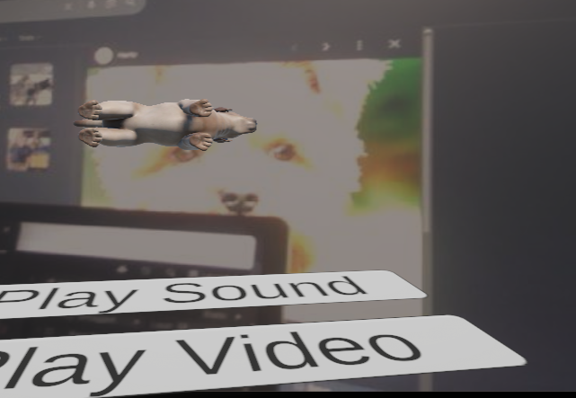
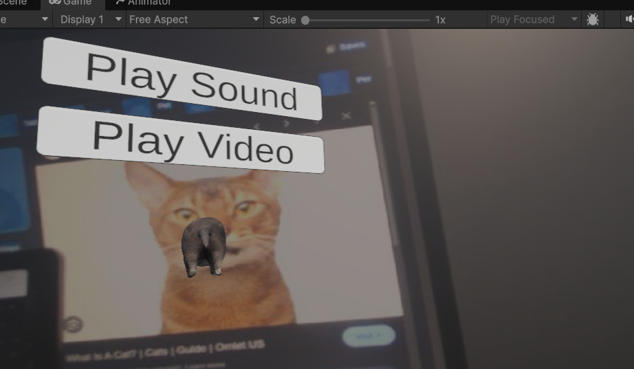
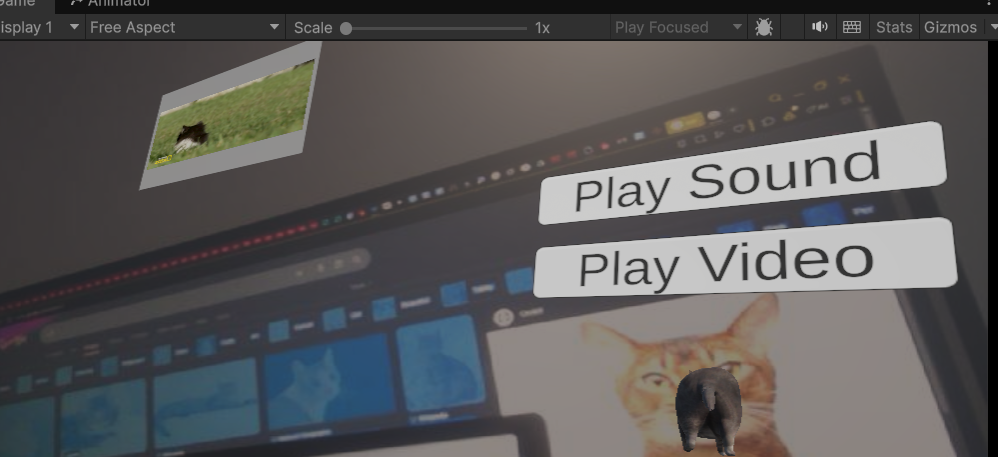

# Unity YOLOv8 Animal Detector

A real-time animal detection system that combines YOLOv8 with Unity3D. The system detects cats and dogs through a webcam feed using a pretrained COCO model, then displays interactive 3D models, sounds, and videos in Unity.

<div align="center">
  
### 📸 Screenshots

| Dog Detection | Cat Detection | Video Playback |
|:-------------:|:-------------:|:--------------:|
|  |  |  |
| *3D dog model displayed above detected dog* | *3D cat model displayed above detected cat* | *Educational video playing when video button is clicked* |

</div>

## 📋 Table of Contents
- [Features](#-features)
- [Tech Stack](#-tech-stack)
- [Prerequisites](#-prerequisites)
- [Installation](#-installation)
- [How It Works](#-how-it-works)


## ✨ Features

- **Real-time Object Detection**: Uses YOLOv8 pretrained on COCO dataset for accurate cat and dog detection
- **Live Camera Feed**: Python script streams webcam footage directly to Unity
- **3D Model Overlay**: Dynamic placement of 3D animal models above detected objects
- **Interactive Elements**: 
  - 🔊 Sound button - Plays animal sounds
  - 🎬 Video button - Plays educational videos about the detected animal
- **Single-File Python**: Everything runs from one Python script - detection, streaming, and communication
- **Modular Design**: Easy to add new animal models and detection classes

## 🛠️ Tech Stack

- **Unity3D** (6) - 3D visualization and UI
- **Python** (3.8+) - YOLOv8 inference, camera streaming, and Unity communication
- **YOLOv8** - Object detection model (Ultralytics)
- **OpenCV** - Camera capture and image processing
- **Socket Programming** - Python-Unity communication
- **Threading** - Concurrent processing of detection and streaming

## 📋 Prerequisites

- Unity v6 or later
- Python 3.8 or later
- Webcam
- CUDA-capable GPU (recommended for real-time detection, CPU works but slower)

## 🚀 Installation

### 1. Clone the repository
```bash
git clone https://github.com/THEAZ3R/AR-AI-Mini-Project.git
cd AR-AI-Mini-Project
